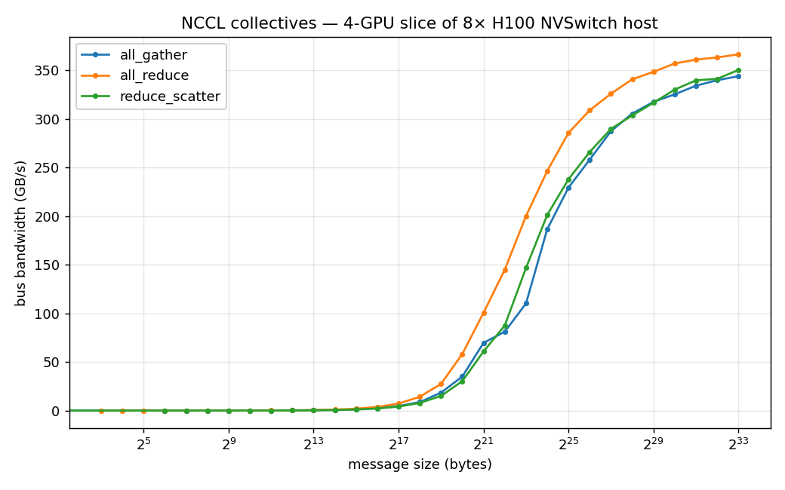
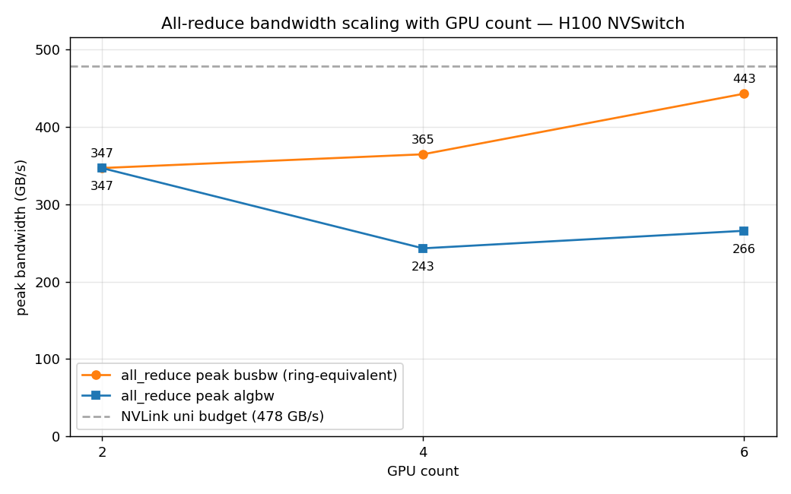
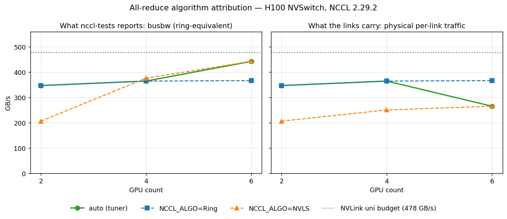
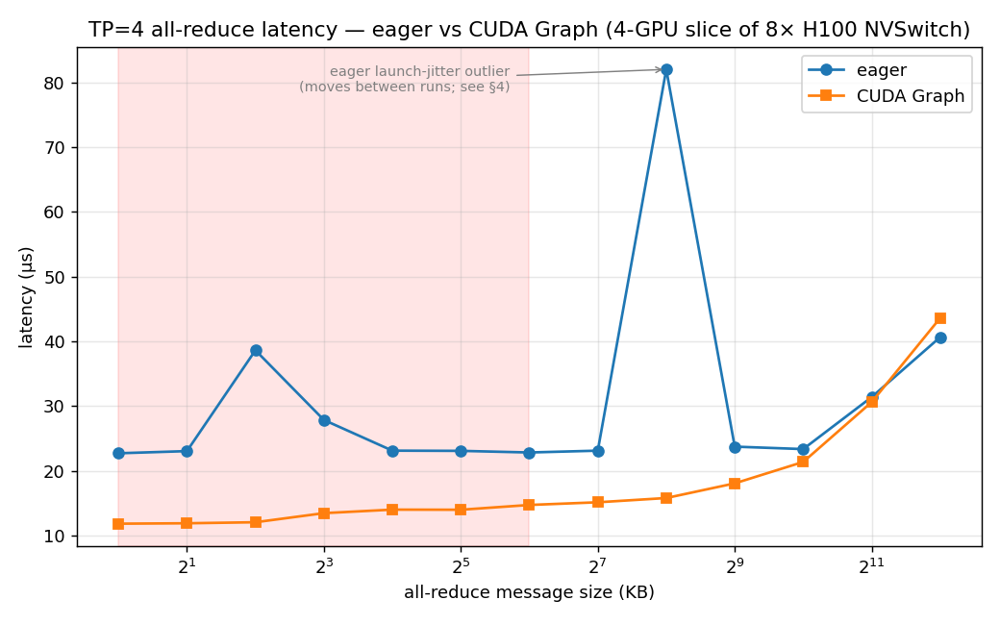
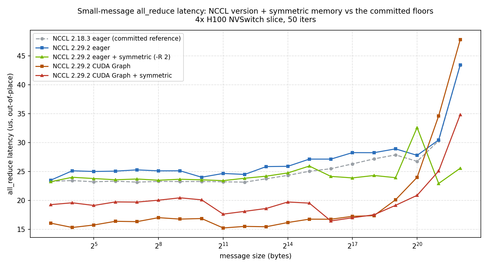

# NCCL Collectives Benchmark — H100 NVSwitch

Micro-benchmarks of the NCCL collective operations that bound distributed LLM training
and tensor-parallel inference — **all-reduce, all-gather, reduce-scatter** — measured on a
**4-GPU slice of an 8× H100 NVSwitch host** (scaling study uses 2/4/6 GPUs), with
bus-bandwidth analysis against the theoretical link budget.

Makes multi-GPU communication concrete: all-reduce bus bandwidth measured across message
sizes, where it saturates NVLink, and why tensor parallelism is communication-bound at
small batch sizes.

## What this is
- A thin, reproducible wrapper over NVIDIA `nccl-tests` (the canonical tool) plus a parser
  that turns raw output into tidy CSV/JSON.
- A bandwidth sweep across message sizes (8 B → 8 GB) for all-reduce / all-gather / reduce-scatter.
- Analysis: measured **bus bandwidth** vs NVLink theoretical, the small-message latency floor,
  and what it implies for TP=4 LLM inference.

## What this is NOT
- Not a reimplementation of NCCL — it drives the official `nccl-tests` and adds analysis.
- Not multi-node (yet) — single 8× H100 NVSwitch box, NVLink. The same harness extends to
  InfiniBand multi-node (roadmap) by changing the launcher.

## Hardware
- 8× NVIDIA H100 80GB SXM5 on an NVSwitch fabric (all pairs NV18); runs use a 4-GPU slice
  (the scaling study sweeps 2/4/6 GPUs). `nccl-tests` + CUDA toolkit.

## Layout
```
scripts/setup_nccl_tests.sh   # clone + build nvidia/nccl-tests
scripts/run_sweep.sh          # all_reduce/all_gather/reduce_scatter across sizes -> results/*.txt
analysis/parse.py             # raw nccl-tests output -> results/*.csv
analysis/plot.py              # bandwidth vs size + busbw/algbw curves -> results/*.png
analysis/theoretical.py       # NVLink budget + % of peak achieved
docs/design-decisions.md      # busbw vs algbw, why all-reduce is the one to watch
docs/roadmap.md
results/                      # outputs (populated on the H100 NVSwitch box)
```

## Quick start (run on the H100 NVSwitch box)
```bash
make setup            # build nccl-tests
make sweep            # run the collective sweeps -> results/
make analyze          # parse + plot + compute % of NVLink peak -> results/report.md
```

## Results — measured on a 4-GPU slice of an 8× H100 80GB SXM5 NVSwitch host (NCCL 2.18.3)

Full writeup: [`results/report.md`](results/report.md). Bandwidth curves: `results/busbw.png`.

NVLink budget (measured via `nvidia-smi nvlink --status`): 18 links × 26.562 GB/s = **478 GB/s** per-GPU unidirectional.

| collective | peak busbw | % of NVLink uni | small-msg latency floor |
|---|---|---|---|
| all_reduce | 366 GB/s | 77% | 22.7 µs |
| all_gather | 344 GB/s | 72% | 16.8 µs |
| reduce_scatter | 350 GB/s | 73% | 21.4 µs |

**Bus bandwidth vs message size: all three collectives sit on a ~23 µs latency floor below ~1 MB, then ramp toward NVLink saturation (~340–366 GB/s) past a few MB — all_reduce leads at every size:**



**Algorithm study (all_reduce busbw):** NVLS (NVLink SHARP, in-network reduction on NVSwitch)
beats Ring at every size — 376 vs 366 GB/s @8GB, 359 vs 340 @256MB — and Tree (259 GB/s,
multi-node-oriented) trails both. **Protocol study @256MB:** Simple 340 / LL128 313 / LL 147 GB/s.

**Scaling with GPU count** (all_reduce, `analysis/scaling.py`): peak busbw 2→347, 4→365,
**6→443 GB/s**; peak algbw 2→347, 4→243, 6→266 GB/s. Read the busbw column with care — busbw
is nccl-tests' *ring-equivalent* normalization (algbw × 2(N−1)/N) and equals physical
per-link traffic only when the algorithm actually is Ring. The attribution run
(`analysis/scaling_attribution.py`: 9 arms, `-g 2/4/6` × {auto, pinned Ring, pinned NVLS},
`NCCL_DEBUG=INFO,TUNING` captured in every log) **measured** what the tuner picks: **Ring at
2/4 GPUs, NVLS at 6 GPUs**. So the 4-GPU 365 is a real per-link rate (76% of budget), but the
6-GPU 443 is NVLS traffic — with in-switch reduction each GPU ships its data once, so the
links physically carry only ~algbw = 266 GB/s (**56% of budget**) and most of the 365→443
rise is the normalization formula, not extra bytes on the wire. Ring's physical link
efficiency is flat across N (73→76→77%); what NVLS actually buys at 6 GPUs is **+21%
end-to-end algbw** (220→266 GB/s vs pinned Ring) — by removing traffic from the links, not by
saturating them. Nine-arm table and debug-log evidence:
[`results/scaling_attributed/report.md`](results/scaling_attributed/report.md); decomposition:
[`results/scaling_report.md`](results/scaling_report.md).

**Peak all_reduce busbw climbs with GPU count (2→347, 4→365, 6→443 GB/s) while algbw falls (347→243→266 GB/s) — the divergence is the ring factor 2(N−1)/N, which is exactly why the busbw curve needs the algorithm attribution above; the dashed line is the 478 GB/s unidirectional per-GPU budget:**



**The attribution run side by side: what nccl-tests reports (left) vs what the links physically carry (right) — the auto/tuner curve tracks Ring at 2/4 GPUs and switches to NVLS at 6, where reported busbw rises to 443 GB/s while physical per-link traffic drops to ~266 GB/s:**



> Note: `make sweep` defaults to 4 GPUs. On a shared box, pin to free GPUs and never touch
> a busy one: `CUDA_DEVICE_ORDER=PCI_BUS_ID CUDA_VISIBLE_DEVICES=2,3,4,5 make sweep`
> (or `--gpus '"device=2,3,4,5"'` under Docker / NGC `nvcr.io/nvidia/pytorch`).

### The TP-inference latency wall
The sweep above is steady-state bandwidth. LLM tensor-parallel decode lives in the *opposite*
regime — tiny (≤64 KB) all-reduces, twice per layer, latency-bound on the ~22 µs floor. See
[`tp_latency/`](tp_latency/): CUDA-Graph capture vs eager, custom one-shot all-reduce vs NCCL,
and an analytical comms-roofline for TP=N decode validated against measurement.

> **Data provenance:** The latency floor and tok/s ceiling values below are from a controlled quiet-box measurement (`results/quiet/tp_latency.json`; eager floor 23.1 µs, graph floor 13.7 µs). The current `results/tp_latency.json` reflects a shared-box re-run under production NVSwitch contention (~36 µs eager); see `results/tp_latency_report.md` §4 for the cross-comparison.

**TP=4 all-reduce latency in the decode regime: CUDA-Graph capture flattens the ~22 µs eager floor (and its launch-jitter spikes) to a stable ~12–15 µs across the small (≤64 KB, shaded) message sizes a TP decode actually uses:**



### Verification: shared-box vs quiet-box re-run (the jitter question)

The original sweep showed an 82 µs eager spike at one message size, initially attributed to
NVSwitch-fabric jitter from other tenants on the box. A controlled re-run with every
non-production tenant stopped (`results/quiet/`) **rejects that attribution**: a same-magnitude
spike reappears at a *different* size, the eager/graph latency floors are unchanged
(~36/~20 µs shared [current shared-box run] → 23.2/12.9 µs quiet), and the bandwidth sweep matches at steady-state
large-message sizes (all_reduce within 4.4%; the all_gather protocol-transition zone,
128 KB–2 MB, shows run-to-run variation up to ~25% — normal NCCL protocol switching, not tenant
interference). The spike is **host-side launch jitter intrinsic to eager-mode submission** — and it never
appears in CUDA-Graph mode in either run. So CUDA Graphs don't just cut TP-decode latency ~1.7×;
they remove its tail jitter (the thing that would show up as p99 ITL spikes in serving). Full
table: [`results/tp_latency_report.md`](results/tp_latency_report.md) §4.

### NCCL ≥2.27 symmetric memory vs the measured floors (the literature-ceiling test)

NCCL 2.27 introduced symmetric (window) buffer registration with a published claim of **up to
9× lower small-message latency**. If real on this box, it would re-price the repo's central
numbers — the 23.1 µs eager floor and the TP-decode comms ceiling derived from it. Measured on
the **same 4-GPU slice** with NCCL **2.29.2** (`scripts/run_symmetric_sweep.sh`; eager + CUDA
Graph, registered `-R 2` vs not; raw logs in `results/symmetric/`, analysis in
[`results/symmetric/report.md`](results/symmetric/report.md)):

| configuration | small-msg floor (µs) | busbw @ 16 MB |
|---|---|---|
| NCCL 2.18.3 eager (committed reference) | 23.3 | 247 GB/s |
| NCCL 2.29.2 eager | 25.1 | 248 GB/s |
| NCCL 2.29.2 eager + **symmetric** | 23.6 | **329 GB/s** |
| NCCL 2.29.2 CUDA Graph | 16.3 | 238 GB/s |
| NCCL 2.29.2 CUDA Graph + **symmetric** | 19.7 | 300 GB/s |



**The 9× does not happen here — and where the gain actually lands is the finding:**

1. **Small-message latency: symmetric registration is neutral** (~23–25 µs floor regardless).
   The 9× claim belongs to paths where registration removes proxy/copy work (multi-node
   networking, NVLS trees) — a 4-GPU NVSwitch all_reduce at small sizes is *launch-bound*, and
   no buffer trick removes kernel launches.
2. **Large-message bandwidth: +33%** (247 → 329 GB/s busbw at 16 MB; 1.7× lower latency at
   4 MB). Symmetric registration enables the zero-copy NVLink path — a bandwidth optimization,
   not a latency one.
3. **NCCL 2.29 is ~2 µs *slower* than 2.18 at small sizes** on identical hardware — version
   upgrades need re-measurement. (Caveat: the 2.18 reference comes from an earlier session;
   other tenants were active outside the measurement slice during this run — see
   `results/symmetric/report.md` — so read this delta as indicative, not controlled.)
4. **The ~23 µs launch floor survives version upgrades and registration alike** — reinforcing
   the repo's central conclusion: only CUDA-Graph capture breaks it, so the TP-decode comms
   ceiling (271/456 tok/s for Llama-70B TP=4) stands unchanged.

---

## References
- [NVIDIA/nccl-tests](https://github.com/NVIDIA/nccl-tests) — the canonical benchmark this harness drives.
- [NVIDIA/nccl](https://github.com/NVIDIA/nccl) — the collective communication library under test.

## Disclaimer
Personal project for learning and benchmarking. Views and results are my own and do not represent any employer.

---

_Part of my portfolio — [waynehacking8.github.io](https://waynehacking8.github.io/). Writeup: [Where tensor-parallel inference hits the NVLink wall](https://waynehacking8.github.io/blog/nccl-nvlink-bandwidth/)._
